# How to use CyVerse

**:material-lightbulb-on: Imagine, Your Lab in the Cloud**

Welcome to scientific research computing in the 21st century! 

While using a mouse in a Graphical User Interface (GUI) is more familiar to most of us, the real power of reproducible science comes from the Command Line Interface (CLI). 

The CLI allows you to give precise, text-based instructions to a computer, automating tasks and managing massive datasets in ways a GUI cannot.

In this lesson, you'll learn to use the CLI on [CyVerse](https://de.cyverse.org){target=_blank}, a powerful, cloud-based platform designed for science. Instead of installing complex software on your own machine, you'll use CyVerse to access everything you need right from your web browser. 

## What is CyVerse?

CyVerse is not just one tool, but a comprehensive _cyberinfrastructure_ built to support researchers throughout the entire data lifecycle ([Swetnam et al. 2024](https://doi.org/10.1371/journal.pcbi.1011270){target=_blank}). 

It's composed of four main integrated platforms:

**Data Management**: At its core, CyVerse provides a robust, large-scale data storage system. It allows you to store, manage, and share massive datasets securely and provides tools for high-speed data transfer. We'll be using this [Data Store](https://data.cyverse.org){target=_blank} today.

**Discovery Environment (DE)**: The [DE](https://de.cyverse.org){target=_blank} is a web-based portal for accessing scientific tools and workflows. You can use its intuitive interface to launch analyses, from simple virtual machines to complex, multi-step bioinformatics pipelines, without needing to be an expert in high-performance computing.

**Cloud Native Services**: For more advanced users, CyVerse offers a container-based, composable infrastructure that runs on [NSF's Jetstream-2 Cloud](https://jetstream-cloud.org){target=_blank}, AWS, GCloud, or Azure. These Infrastructure as Code (IaC) tools allows you to deploy your own custom applications and services at scale, giving you greater flexibility and control over your computational environments.

**Artificial Intelligence (AI/ML)**: [AI-Verde](https://chat.cyverse.ai){target=_blank}, provides access to cutting-edge hardware, including GPUs, and pre-configured tools to support generative AI (LLMs). In the Discovery Environment, and on Jetstream-2, we support a wide array of machine learning and artificial intelligence research. These platforms makes it easier to train, test, and deploy AI models on large datasets.

Today, we will use the **Data Store** to move files and the **Discovery Environment** to launch virtual analyses. We will briefly introduce generative AI tools. Next week, we'll focus on the AI/ML platforms to run a large language model and practice prompt engineering in more depth.

### CyVerse Account Creation

1. Create your account: [https://user.cyverse.org](https://user.cyverse.org){target=_blank}

    You should be prompted to set a valid email address, an then create a password. For the sake of this workshp, use the same email address you gave to GERI-NEON staff.

2. Enroll in the GERI-NEON workshop: [https://user.cyverse.org/workshops/194](https://user.cyverse.org/workshops/194){target=_blank}

    As part of GERI-NEON, you will be granted special access to CyVerse. 

    We have pre-registered the email account you enrolled with GERI-NEON in the workshop enrollment form. 

    AFTER you have created and verified your CyVerse account, go to the Workshops in the User Portal and find the GERI-NEON workshop. Click on 'Enroll' to be automatically added to the workshop.

    Your account will be promoted and you will be given access to the Discovery Environment's interactive applications (which we will use in the next section)

3. Log into the Discovery Environment (DE): [https://de.cyverse.org](https://de.cyverse.org){target=_blank}

### Discovery Environment Tour

If this is your first time logging into the DE, allow the Tour to show you all of the GUI features.

### Starting a VICE App

Let's start out with the [:octicons-terminal-24: Cloud Shell](https://de.cyverse.org/apps/de/5f2f1824-57b3-11ec-8180-008cfa5ae621/launch){target=_blank}

Interactive Apps (GUI) can be found in the [Featured Apps list](https://de.cyverse.org/apps){target=_blank}

Launch a Cloud Shell from the list or from the quick launch icon in the Tool Bar by clicking on the :octicons-terminal-24: icon.

## The Unix Shell

The CLI sees the computer stripped down to only a [Terminal](https://en.wikipedia.org/wiki/Terminal_emulator){target=_blank} from where one can run powerful commands executed through the [Shell](https://en.wikipedia.org/wiki/Shell_(computing)){target=_blank}.

Though there are technical differences between them, the terms **Command Line Interface**, **Terminal**, **Shell**, and **BASH** will be used more or less interchangeably throughout the lesson. 


<br>
<br>

!!! Warning "**Attention** :material-microsoft-windows: Windows users"

    Much of what we are going to be teaching is based on open-source software which operates on cloud and is incompatible with Windows OS.

    Unix-based systems such as Linux [:material-ubuntu: Ubuntu](https://ubuntu.com/){target=_blank} and [:material-apple: MacOS X](https://www.apple.com/macos/){target=_blank}, as many scientific tools require a Unix Operating System (OS). 
    
    There are a number of software that allow :material-microsoft-windows: Windows users to execute Unix commands, however we recommend the use of [:simple-linux: Windows Subsystem for Linux (WSL) 2.0](https://docs.microsoft.com/en-us/windows/wsl/install){target=_blank}.

    ??? tip "Quickstart installation of Window's WSL"

        !!! warning "A system reboot is necessary"

        1. Open :material-powershell: PowerShell in Administrator mode (open :octicons-search-16: Search and look for PowerShell, right click and select "Run as Administrator")
        2. type `wsl --install`
        3. Restart your machine
        4. Open :octicons-search-16: Search and open :simple-linux: WSL; create a username and password, wait for it to finish setting up (should take a few minutes)
        5. You're now ready to use :simple-linux: Linux on your Windows Machine!

        ??? question "Where is the WSL Home folder?"
            
            The Home folders for Linux and Windows are different. The Windows path to the :simple-linux: WSL home folder is `\\wsl$\Ubuntu\home\<username>`.
            
            We suggest creating a bookmark in your Windows machine to allow quicker access to the :simple-linux: Linux partition (for quicker access to files).

            To quickly open the folder, open :simple-linux: WSL and execute `explorer.exe .`. This will open a folder in Windows at the Linux Home folder. 


## Managing Your CyVerse Data with GoCommands

Before launching an analysis, you need a way to move data between your personal computer and the CyVerse Data Store. The best tool for this is [`gocmd`](https://learning.cyverse.org/ds/gocommands/){target=_blank}, a command-line client written by CyVerse research software engineers in Google's Go langauge. 

You can install and run `gocmd` in your computer's terminal to move files from your computer(s) into CyVerse. You can also use `gocmd` to move files around CyVerse Data Store.

1. Install and Configure GoCommands

Installation instructions vary by operating system (Windows, macOS, Linux). Please follow the complete, up-to-date guide on the CyVerse Learning site.

!!! info "GoCommands Installation Guide"
    
    Visit the [official GoCommands Installation and Configuration Guide](https://learning.cyverse.org/ds/gocommands/configuration/){target=_blank} and follow the steps for your operating system.

    Optionally, add the `gocmd` binary to your `PATH` environmental variable or `.bashrc`


The most important step is running `gocmd init` to connect the tool to your CyVerse account.

You will be queried to enter CyVerse specific information for the Data Store. You can leave the [default values for the configuration](https://learning.cyverse.org/ds/gocommands/configuration/#using-the-init-command){target=_blank}. 

| Configuration Key | Value |
|-------------------|-------|
| `irods_host`      | `data.cyverse.org` |
| `irods_port`      | `1247` |
| `irods_zone_name` | `iplant` |
| `irods_user_name` |  `<CyVerse Username>` |
| `irods_user_password` | `<CyVerse Password>` |

Use these credentials for `anonymous` access to the Data Store:

| Configuration Key | Value |
|-------------------|-------|
| `irods_user_name` | `anonymous` |
| `irods_user_password` | (leave empty) |

```mermaid
graph LR
    subgraph "Your Local Machine"
        direction LR
        Local_PC[("💻<br>Local Computer")]
        Local_Files["Local Files<br>(e.g., my_data.csv)"]
    end

    subgraph "CyVerse Cloud Platform"
        direction TB
        
        subgraph "Jupyter Lab (Ephemeral Storage)"
            direction TB
            VM["⚙️ Jupyter Lab VM"]
            VM_FS["VM Filesystem<br>(/home/jovyan, etc.)"]
            VM_Mount["/data-store<br>(Mount Point)"]
            VM --> VM_FS
            VM --> VM_Mount
        end

        subgraph "CyVerse Data Store (Persistent iRODS Storage)"
            direction TB
            iRODS[("☁️<br>iRODS Data Store")]
            iRODS_Home["/iplant/home/&lt;user&gt;"]
            iRODS_Shared["/iplant/home/shared"]
            iRODS --> iRODS_Home
            iRODS --> iRODS_Shared
        end

        VM_Mount -- "Mounted via<br>Kubernetes CSI Driver" --> iRODS
    end

    Local_PC -- "Transfer via<br>gocmd put/get" --> iRODS

    classDef system fill:#f0f9ff,stroke:#0ea5e9,stroke-width:2px;
    classDef storage fill:#eef2ff,stroke:#6366f1;
    classDef connector stroke-dasharray: 5 5;
    class Local_PC,VM,iRODS system;
    class Local_Files,VM_FS,VM_Mount,iRODS_Home,iRODS_Shared storage;
```




1. Transfer Data
   
Once installed and configured, you can manage your files from your local terminal. Here are the essential commands:

| Command | Explanation |
|---------|-------------|
| `gocmd ls` | list the contents of your home directory in the CyVerse Data Store. |
| `gocmd put <local_file>` | put (upload) a file from your computer to your CyVerse home directory. |
| `gocmd get <cyverse_file>` | get (download) a file from your CyVerse home directory to your computer. |

Example: Let's say you have a file my_data.csv on your computer that you want to analyze in CyVerse.

On your local computer's terminal

First, upload the file to CyVerse

```bash
gocmd put my_data.csv
```

You can verify it's there by listing your files

```bash
gocmd ls
```

Now the file is in the CyVerse Data Store, ready to be used in an analysis.

??? Tip "Other ways to move data to CyVerse"

    There are several ways to access the Data Store. These methods vary in speed, flexibility, and technical knowledge required. Different methods may suit your needs for different projects at different times.

    | Method | Access Point | OS | Upload/Download | Installation/Setup Required | Account Required | Max File Size |
    |--------|--------------|----|-----------------|-----------------------------|-----------------|---------------|
    | Discovery Environment  | Web                        | Any              | Both            | No                          | Yes                      | 2GB/file upload, no limit for import |
    | WebDAV                 | Web & Command line         | Any              | Both            | No                          | Yes (No for public data) | No limit              |
    | GoCommands             | Command line               | Any              | Both            | Yes                         | Yes (No for public data) | No limit              |
    | iCommands              | Command line               | Linux & macOS    | Both            | Yes                         | Yes (No for public data) | No limit              |
    | SFTP                   | Desktop App & Command line | Any              | Both            | No (Yes for desktop app)    | Yes (No for public data) | No limit              |


??? Tip "Not Comfortable with the CLI yet?"

    That is totally okay! 

    There are many GUI based ways to move data to CyVerse Data Store.

    * [Discovery Environment](https://de.cyverse.org/data/){target=_blank}

    * [CyberDuck](https://learning.cyverse.org/ds/sftp/cyberduck){target=_blank}

    * [FileZilla](https://learning.cyverse.org/ds/sftp/filezilla/){target=_blank}

### CyVerse VM File System Layout (Ubuntu)

This diagram illustrates the typical file system structure you'll encounter in a CyVerse virtual machine.


Diagram Key

Solid Lines (`-->`): Represent a direct parent-child relationship in the file system (e.g., /home is inside /).

Dotted Lines (`-.->`): Represent a symbolic link. The `/home/jovyan/data-store` folder is a shortcut that points directly to the `/data-store` mount point.

`/data-store`: This is not a normal directory. It's a special mount point managed by Kubernetes, connecting your virtual machine to the main CyVerse Data Store.

## Launching a Virtual Machine in the DE

Now that your data is in the cloud, you can launch a virtual machine to work with it. We recommend starting with a Cloud Shell, or Jupyter Lab, as both provide a user-friendly interface with a built-in terminal.

### Log in to the CyVerse Discovery Environment.

Click the [Apps button](https://de.cyverse.org/applications){target=_blank} to open the Apps window.

Search for a "Jupyter Lab" and select the latest version.

On the App page, you can give your analysis a name. For now, the default settings are fine.

Click Launch Analysis. Your App will take a few moments to start.

Once the status says "Running," click the hyperlink for your analysis. A new browser tab will open with your Jupyter Lab session.

The Gateway to Commands: The Terminal
All actions from this point forward will be performed inside the terminal of your CyVerse virtual machine.

To Open the Terminal in Jupyter Lab: Click the File menu -> New -> Terminal.

You will see a window with a prompt, waiting for your commands. This is the Shell.

### File System Navigation

The commands for navigating the file system in your VM are the same standard Unix commands you would use elsewhere.

| Command | Explanation |
| `pwd` | print working directory (shows you where you are) |
| `ls -F` | list the contents of a directory with file-type indicators (/ for dir) |
| `cd <directory>` | change directory |
| `mkdir <directory>` | make a new directory |
| `mv <source> <destination>` | move or rename a file or directory |
| `rm <file>` | remove (delete) a file |

First, you'll need to get the data you uploaded with gocmd from the Data Store into your running VM. For this, we use `gocmd get`  to move files.

#### In your CyVerse VM Terminal

##### Download the file from the Data Store to your VM

```bash
cd

gocmd get --progress /iplant/home/shared/geri/geri-neon-workshop
```

The `get` command tells the `gocmd` program to "get" or download data. the `--progress` command tells the program to print out verbose updates as the download runs.


Now you can see it in your VM's file system

```bash
ls -F
```

Is the `geri-neon-workshop/` folder there? What do you see?

### Create a reproducible Python environment with a package manager

To ensure your analysis is reproducible, you should define the exact software and versions you need. We can do this using a Conda environment managed by `mamba`, a fast implementation of the `conda` package manager.

We will define our environment in a special file called `environment.yaml`

1. Create the Environment File
In your terminal, create the file using the nano text editor:

```bash
cd ~/geri-neon-workshop/sample-data
ls -F
cat cowsay.yml
```

```yaml
# environment.yml
# This file defines the Conda environment for the CLI art app.
#
# To create the environment, run:
# conda env create -f environment.yml
# To activate the environment, run:
# conda activate cli_art_env
#
# IMPORTANT: This app also requires the following command-line tools
# which should be installed with your system's package manager:
#
# On Debian/Ubuntu (using apt-get):
#   sudo apt-get update
#   sudo apt-get install cowsay fortune lolcat
#
# On macOS (using Homebrew):
#   brew install cowsay fortune lolcat
#
# On Fedora/CentOS (using dnf):
#   sudo dnf install cowsay fortune-mod lolcat

name: cowsay

channels:
  - conda-forge
  - defaults

dependencies:
  - python=3.9
  - pip
  - rich
```


??? Tip "Conda vs Mamba"

    [Conda](https://conda.org){target=_blank} is the original, industry-standard, open-source system for managing packages and environments for any language. It is robust and widely trusted.

    [Mamba](https://mamba.readthedocs.io/){target=_blank} is a re-implementation of the `conda` package manager in C++. It uses the same commands and configuration but dramatically improves speed by using parallel processing for downloading packages and a much faster dependency solver. For our purposes, it is a drop-in replacement for `conda` that will make setting up our environments much faster.

    You might also be familiar with `pip`, Python's standard package manager, which installs packages from the Python Package Index (PyPI). While Conda/Mamba can manage packages for any language and even the Python interpreter itself, `pip` is exclusively for Python. It's common to use `pip` to install a package inside a Conda environment if that package isn't available on Conda channels. The general rule is to use Conda/Mamba whenever possible, and then use `pip` for any remaining Python-specific packages.


1. Build and Activate the Environment
   
Now, use `mamba` to create the environment from your file.

```bash
mamba env create -f cowsay.yml
```

Approve the installation

Mamba will download and install the specified packages. Once it's finished, you can activate your new environment to start using it.

```bash
conda activate cowsay
```

Your terminal prompt should now change to show (plotting_env), indicating that you are inside the environment. Any command you run will use the software installed there.

To exit the environment, simply run:

```bash
conda deactivate
```

#### Run the app

After you've activated the new conda environment, run the app.

```
python cowsay.py
```

What happens?

#### Managing Analyses

In the [https://de.cyverse.org/analyses](https://de.cyverse.org/analyses){target=_blank} you can view your running or completed analyses.

Your analysis should have an active timer counting down, if it is still active. You can extend the time by clicking on the ellipses and selecting extend time.

You can also terminate your app by clicking on the red X. 

Note: apps will time out on their own, but they will burn your valuable allocation hours if left running.

Practice shutting down your app by clicking on the check box and terminating it.

## Jupyter Lab GPUs w/ Ollama

Start a new App. 

In Apps, [https://de.cyverse.org/apps](https://de.cyverse.org/apps){target=_blank} choose a [Jupyter Lab Pytorch GPU](https://de.cyverse.org/apps/de/e19a5772-94e6-11ec-b1f0-008cfa5ae621/launch)

!!! Tip "Waiting for apps to start"

    When you start an interactive application expect to wait a minute or two. It should not take more than 5 minutes to start an Featured application -- private apps may take longer because their Docker container must be downloaded from an external registry into CyVerse.

### Run Your Own AI Model with Ollama

For advanced tasks, CyVerse offers Apps with Graphics Processing Units (GPUs), which are essential for AI and machine learning. These GPU-enabled Apps come with [Ollama](https://ollama.org){target=_blank} pre-installed. Ollama lets you easily run powerful, open-source Large Language Models (LLMs) locally within your private session.

1. Download an AI Model
To use a model, you first need to download it. We'll use `gemma:2b`, a relatively small but capable model from Google. This command only needs to be run once per VM.

#### In your CyVerse GPU VM Terminal

1. Open a Terminal in your Jupyter Lab

    Install a small Gemma model from the Ollama registry:

    ```bash
    # Install Ollama
    pip install ollama
    # Start Ollama Server
    ollama serve
    ```

2. Run the Model 
   
    Open another terminal window.
    
    ```bash
    ollama pull gemma:2b
    ```
    
    Now you can run the model and interact with it directly from your command line.

    ```bash
    ollama run gemma:2b
    ```

    The prompt will change, and you can now ask the AI questions. Let's try one related to our last topic:

    ```python
    >>> What is the purpose of a conda environment?
    ```

    The model will generate a detailed explanation right in your terminal. To exit the Ollama session, type `/bye` and press Enter.

This gives you a powerful, private AI assistant that can help you write code, debug errors, and understand complex topics—all within your secure CyVerse environment. We will explore this in much more detail in the next lesson!


## Introductory Shell Commands

The following tutorial material was taken from the [Carpentries Shell Module](https://swcarpentry.github.io/shell-novice/). 

!!! info "Download Some Data from the Carpentries"
    
    To follow along with the tutorial, please download and unzip this data. [shell-lesson-data.zip](https://swcarpentry.github.io/shell-novice/data/shell-lesson-data.zip) 
        
    ??? Tip "The Command Line Way to Download and Unzip!"
        
        Execute the following commands:
        
        ```bash
        $ sudo apt install unzip
        $ wget https://swcarpentry.github.io/shell-novice/data/shell-lesson-data.zip
        $ unzip shell-lesson-data.zip
        ``` 

<br>
<br>
<br>

### More Carpentries Lessons on Linux Command line
- [Pipes and Filters](https://swcarpentry.github.io/shell-novice/04-pipefilter.html)
- [Loops](https://swcarpentry.github.io/shell-novice/05-loop.html)
- [Scripts](https://swcarpentry.github.io/shell-novice/06-script.html)
- [Finding Things](https://swcarpentry.github.io/shell-novice/07-find.html)

<br>
<br>
<br>

---